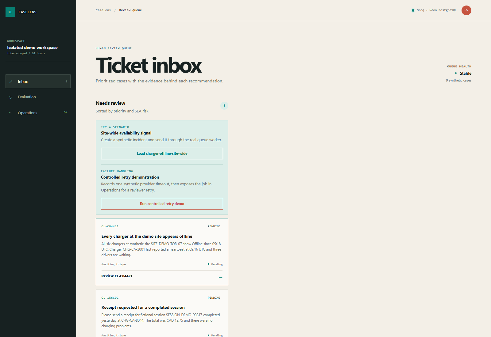
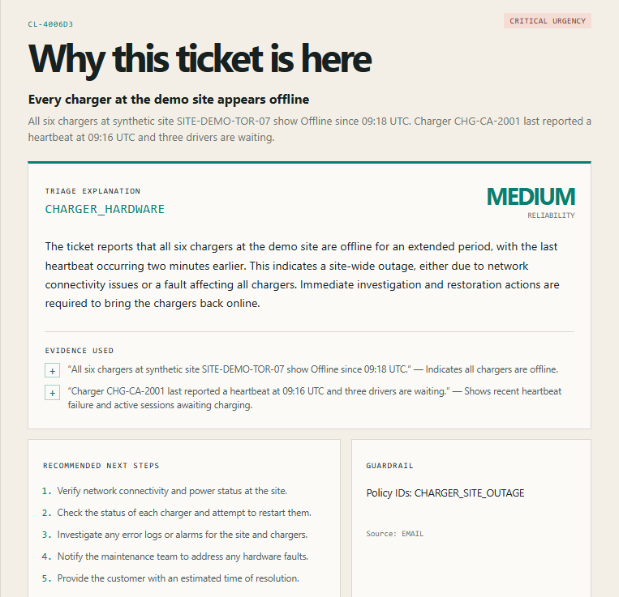
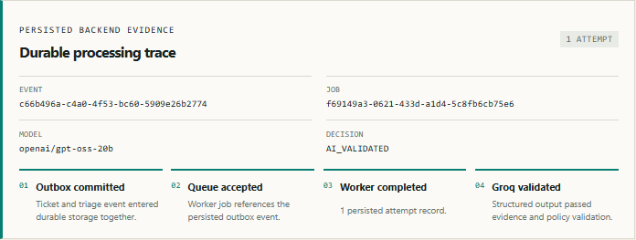
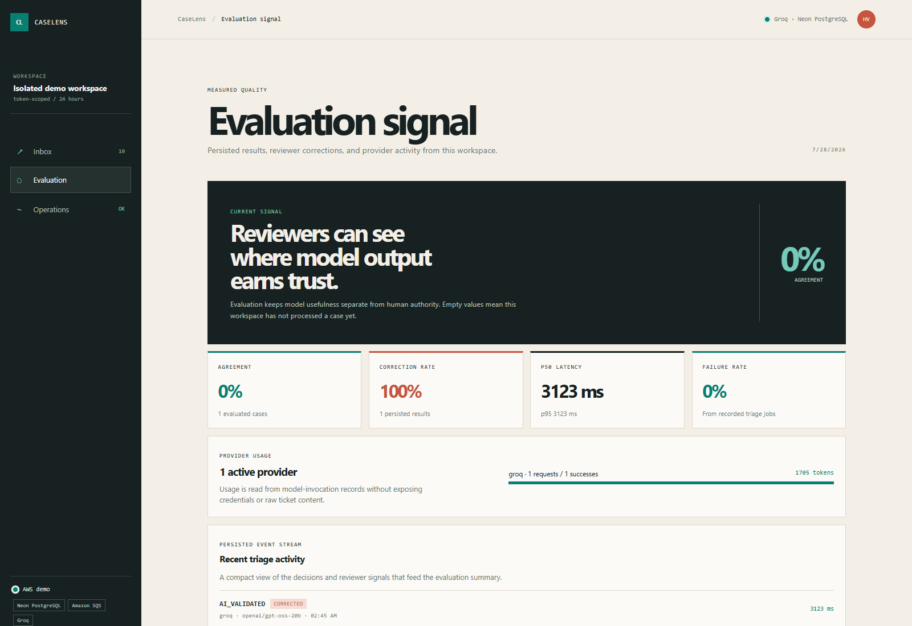
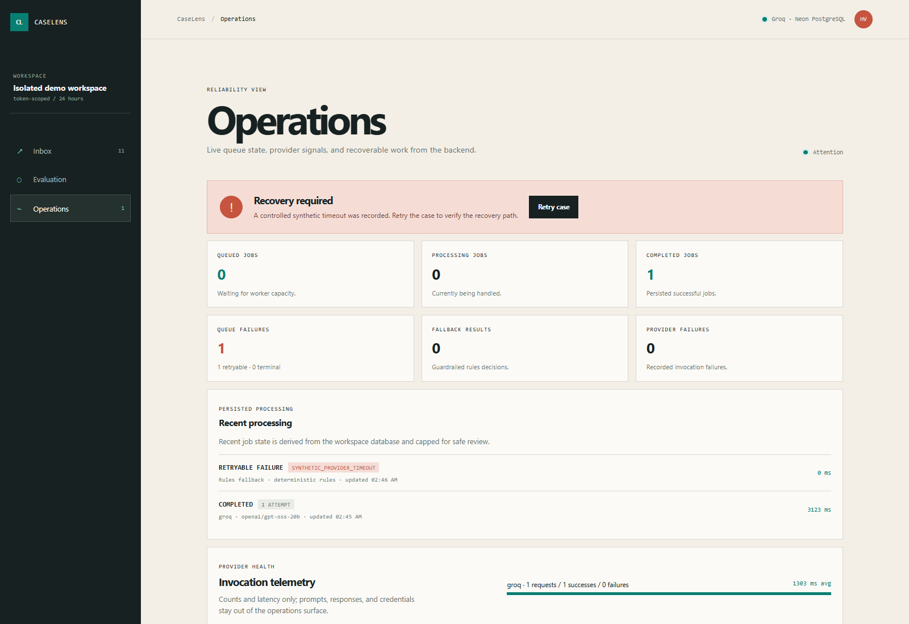

# CaseLens

CaseLens is an explainable support-ticket triage platform for small support and
production-operations teams. It demonstrates trustworthy classification,
deterministic prioritization, human review, asynchronous processing, and
production-minded failure handling. All bundled and publicly stored ticket data
is synthetic.

The reviewer console calls the Spring Boot API, stores state in Neon
PostgreSQL, publishes work through SQS, and uses Groq for the reviewed demo
path. A deterministic provider keeps automated tests and offline development
repeatable. A separate Gemini adapter remains available.

Live demo: [https://d27d60ya5pvyzq.cloudfront.net](https://d27d60ya5pvyzq.cloudfront.net)

## Review the live system

Open the live demo and select **Launch live demo**. CaseLens creates an
isolated, 24-hour workspace containing synthetic records only. No account is
required.

1. Load **charger-offline-site-wide** from the ticket inbox.
2. Open the case and inspect its deterministic priority, exact evidence,
   policy, recommended actions, and suggested reply.
3. Expand **Durable processing trace** to follow the database outbox, SQS job,
   worker attempt, provider validation, and stored result.
4. Save an urgency correction, then open **Evaluation** to see metrics derived
   from persisted results and feedback.
5. Run the controlled retry scenario and use **Operations** to inspect and
   recover its bounded synthetic failure.

The first launch or triage request can take several seconds when Lambda or
Neon has scaled down. Later requests normally use warm infrastructure.

## Product tour

### Isolated review queue



Each launch creates a temporary workspace with synthetic tickets, scenario
controls, and the deployed runtime services visible in the console.

### Evidence-grounded triage



The result keeps the category, urgency, reliability signal, explanation, exact
ticket evidence, recommended actions, and policy guardrail together.

### Durable processing trace



The application exposes the persisted outbox, SQS, worker, model-validation,
decision-source, and attempt states behind the recommendation.

### Human correction and evaluation



Reviewer corrections remain separate from the original model result and update
agreement, correction, latency, provider-usage, and activity metrics.

### Recoverable failure handling



The controlled retry scenario records a synthetic timeout and surfaces its queue
state, processing evidence, provider telemetry, and reviewer recovery action.

## Technical overview

| Area | Technology and implementation |
| --- | --- |
| Reviewer interface | React 19, TypeScript, Vite, TanStack Query, responsive CSS, Vitest, and Playwright |
| Application | Java 21, Spring Boot, Spring Security, Spring Data JPA, Flyway, and a modular-monolith boundary around the API, domain, worker, and relay |
| Durable data | Neon PostgreSQL 16 with workspace-scoped records, immutable original results, human feedback, and database-derived evaluation metrics |
| Asynchronous processing | Transactional outbox, Amazon SQS and DLQ, EventBridge recovery, idempotent job claims, bounded retries, and operator replay |
| AI safety | Groq for the live path, a Gemini adapter, strict structured output, redaction, exact-evidence and policy validation, deterministic priority, and rules fallback |
| AWS runtime | API Gateway, Java Lambda with SnapStart aliases, S3, CloudFront, CloudWatch, Secrets Manager, and least-scope runtime IAM |
| Delivery and verification | Terraform, GitHub Actions with AWS OIDC, Docker, LocalStack, Testcontainers, Trivy scanning, and protected manual teardown |

Short-lived signed sessions isolate each reviewer workspace. Rate limits,
sanitized logs, durable correlation IDs, health probes, queue telemetry, and a
controlled retry scenario make failure behavior inspectable in the demo.

See [the architecture](docs/architecture.md),
[verification record](docs/verification.md),
[threat model](docs/threat-model.md), and
[deployment notes](docs/deployment.md) for implementation details and current
evidence.

## Prerequisites

- Java 21 (newer installed JDKs must compile with the configured Java 21 target)
- Node.js 22 LTS or Node.js 24 LTS and npm 10 or later
- Docker Desktop with Docker Compose
- PowerShell 7 on Windows, or Bash on macOS/Linux

## Run the local product

Create a local environment file before starting services.

Windows PowerShell:

```powershell
Copy-Item .env.example .env
```

macOS/Linux:

```bash
cp .env.example .env
```

For a live Groq run, set `CASELENS_AI_PROVIDER=groq` and add the key to
`GROQ_API_KEY` in the ignored `.env`. To use Neon instead of the local
PostgreSQL container, place its JDBC URL, role, and password in the datasource
variables in `.env`. The reviewed model is `openai/gpt-oss-20b`. Select `mock`
only for offline work and automated tests.

Start PostgreSQL 16 and LocalStack SQS.

Windows PowerShell:

```powershell
./scripts/dev-up.ps1
```

macOS/Linux:

```bash
./scripts/dev-up.sh
```

Start the backend in one terminal and the built frontend preview in a second.

Windows PowerShell:

```powershell
./scripts/backend-dev.ps1
Set-Location frontend
npm ci
npm run build
npx vite preview --host 0.0.0.0 --port 4173
```

macOS/Linux:

```bash
./scripts/backend-dev.sh
cd frontend
npm ci
npm run build
npx vite preview --host 0.0.0.0 --port 4173
```

Stop local dependencies with `./scripts/dev-down.ps1` on Windows or
`./scripts/dev-down.sh` on macOS/Linux.

Open [http://localhost:4173/](http://localhost:4173/) and select **Launch live
demo** to create an isolated local workspace. No account is required. The
backend is available at `http://localhost:8080`; its health endpoint is
`http://localhost:8080/actuator/health`.

The local UI supports:

- isolated reviewer sessions and workspace reset;
- a prioritized synthetic inbox, normal scenario launcher, and controlled
  retry demonstration;
- asynchronous triage through the outbox and SQS worker;
- a durable processing trace with event/job IDs, attempts, model, decision
  source, and latency;
- exact evidence, policies, explanations, recommended actions, and suggested replies;
- AI-validated results with deterministic rules fallback;
- human urgency corrections stored beside immutable original results;
- evaluation metrics derived from persisted results and feedback, with a recent
  event stream showing provider, model version, decision source, latency, and
  reviewer correction state;
- live operations telemetry for queued, processing, completed, retryable, and
  terminal jobs, provider failures, rules fallbacks, recent processing, and
  retry actions. Evaluation and Operations refresh every five seconds while
  their views are open.

## Verification commands

Run the backend and frontend checks:

Windows PowerShell:

```powershell
./scripts/test.ps1
```

macOS/Linux:

```bash
./scripts/test.sh
```

Run each workspace directly when iterating. Use `Set-Location frontend` in
PowerShell or `cd frontend` in Bash:

```powershell
./scripts/backend-dev.ps1
Set-Location frontend
npm ci
npm run dev
```

```bash
./scripts/backend-dev.sh
cd frontend
npm ci
npm run dev
```

The backend helpers load the root `.env` file into their process before
invoking Maven. Most backend tests use the in-memory test profile. The complete
backend test command also runs PostgreSQL Testcontainers integration tests and
therefore requires Docker. The LocalStack integration test skips when Docker is
unavailable.

The complete local verification also includes:

Windows PowerShell:

```powershell
Set-Location backend
./mvnw.cmd -B -ntp test
Set-Location ../frontend
npm test -- --run
npm run lint
npm run typecheck
npm run build
npm run test:e2e
Set-Location ../infra/terraform
terraform fmt -check -recursive
terraform init -backend=false -input=false
terraform validate
```

macOS/Linux:

```bash
cd backend
./mvnw -B -ntp test
cd ../frontend
npm test -- --run
npm run lint
npm run typecheck
npm run build
npm run test:e2e
cd ../infra/terraform
terraform fmt -check -recursive
terraform init -backend=false -input=false
terraform validate
```

## Provider and data boundaries

The Groq adapter uses the OpenAI-compatible chat-completions API with bearer
authentication, strict JSON Schema for the default model, JSON Object Mode for
other explicitly configured models, bounded retry behavior, a configurable
request timeout, and policy IDs constrained by the versioned catalog. The
application still
validates the complete structured result and falls back to deterministic rules
when provider output is unavailable or invalid. Gemini remains available via
its separate adapter. Ticket text is redacted before provider submission.
Model invocation records store provider metadata, timing, status, and usage
counts—not API keys, raw tickets, request bodies, or raw provider responses.

The first release intentionally does not include customer authentication, RAG,
embeddings, Kubernetes, real OCPP traffic, real payment processing, or a live
helpdesk integration. The EV-charging examples are company-neutral synthetic
fixtures.

## AWS deployment

Terraform under `infra/terraform` provisions the private frontend bucket,
CloudFront access control, SQS/DLQ, Secrets Manager placeholder, Lambda roles,
CloudWatch alarms, API Gateway, and optional Java 21 Lambda compute. GitHub
Actions validates the backend, frontend, Terraform, containers, and security
checks, and contains an OIDC-based publish path.

The live demo runs in AWS `ca-central-1` with CloudFront and a private S3
origin, API Gateway, three Java 21 Lambdas, SQS/DLQ, EventBridge, CloudWatch,
Secrets Manager, and Neon PostgreSQL. Terraform state is held in a separate
private, versioned S3 bucket. The protected manual destroy workflow preserves
that state bucket while removing the application stack.

See [security hardening](docs/security-hardening.md),
[evaluation metric definitions](docs/evaluation-metrics.md), and the
[reviewer walkthrough](docs/reviewer-walkthrough.md) for more detail.
