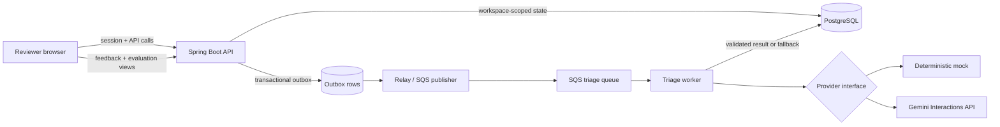

# CaseLens architecture

## Runtime flow

The API owns authentication, workspace isolation, ticket lifecycle, triage
requests, feedback, evaluation, and operational recovery. The queue worker
owns processing and idempotent job claims. PostgreSQL is the durable source of
truth; SQS is delivery infrastructure, not the system of record.

## Trust boundaries

1. The browser is untrusted. It receives only a short-lived demo token and
   synthetic workspace data.
2. The API validates the token, scopes every repository query by workspace,
   validates request limits, and emits safe problem responses.
3. The provider boundary receives a redacted ticket. The model cannot set the
   numeric priority and its evidence and policy IDs are validated before a
   result is persisted.
4. The queue contains identifiers and sanitized correlation metadata. Workers
   reload the ticket from PostgreSQL rather than trusting queue payload text.
5. Cloud deployment keeps frontend and artifact buckets private behind
   CloudFront and uses GitHub OIDC rather than long-lived deployment keys.

## Deliberate first-release choices

- A modular monolith keeps the domain rules inspectable while still showing
  asynchronous delivery and failure recovery.
- PostgreSQL transactions plus an outbox avoid the dual-write gap between a
  triage request and queue publication.
- SQS/DLQ provides bounded retry behavior without requiring Kubernetes.
- A provider-neutral interface makes offline mock runs deterministic and keeps
  Gemini-specific transport code isolated.
- A managed PostgreSQL service is left as an explicit deployment decision; the
  first release does not hide that operational and cost trade-off.
